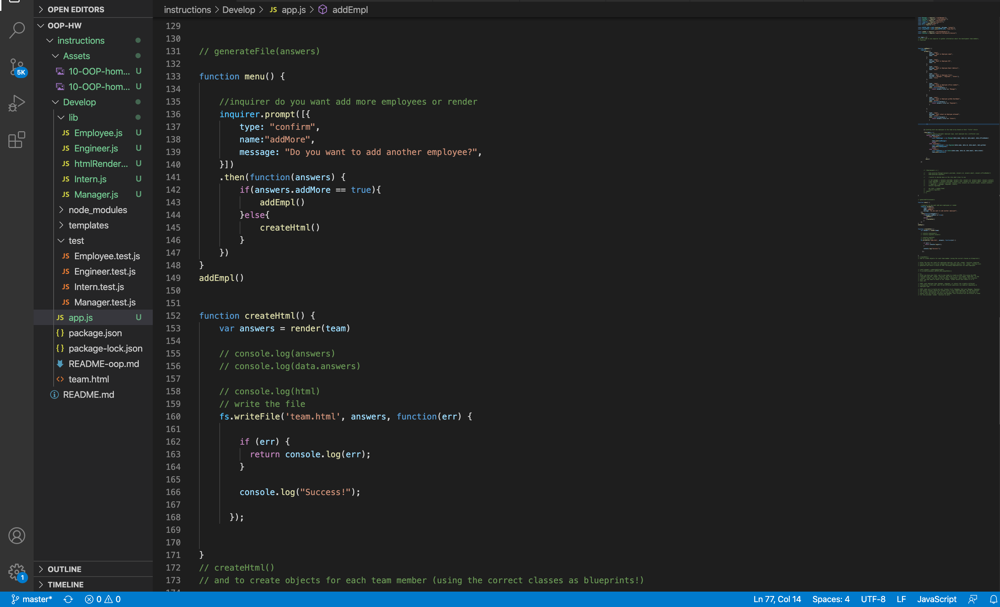

# Team Profile Generator

## Description
- Create a team profile generator using classes, subclasses and constructors in node

### Methods
* Created an emplyee class and a constructor with the arguments for name, id, and email and the methods of getname(), getID(), getEmail() and a getRole(), which would always return an employee. Then created subclasses that extend from the 'super' of employee. Each subclass would require the original Employee class, but would return a different getRole() and one seperate method based on the type of employee, engineers exception method is getGithub(), for manager it is getOfficeNumber() and intern is get school().

* Used NPM package inquirer to extract information about each employee. For the exception methods of getRole(), getGithub(), getOfficeNumber(), and getSchool() an additional 'when' parameter was added which returned the answers and passed them into the .then switch function. This function would declare the employee type based on the users answers to the 'title' prompt and push the results to an empty 'Team' array

* 'Menu' function added to give the option of inputing as many employees as user would like.

* CreateHtml function writes the file team.html using the required render file. The team array contains all the user input information and is passed as parameter into the render file. The render file is stored as the variable answers which is passed into the writeFile function along with the path 'team.html' and a callback error.

### Libraries
- NPM inquirer
- NPM Jest

### Images

<!-- /Users/riritree/Documents/UCF/Homework/OOP-HW/instructions/Assets/OOPHW.png -->

